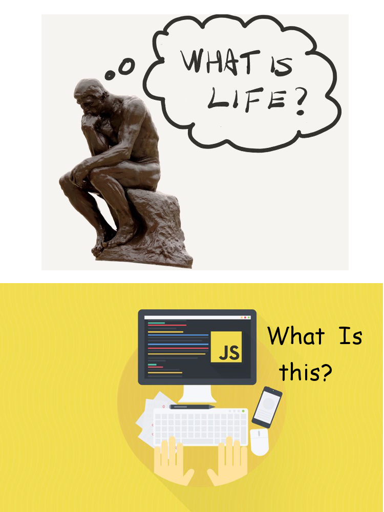
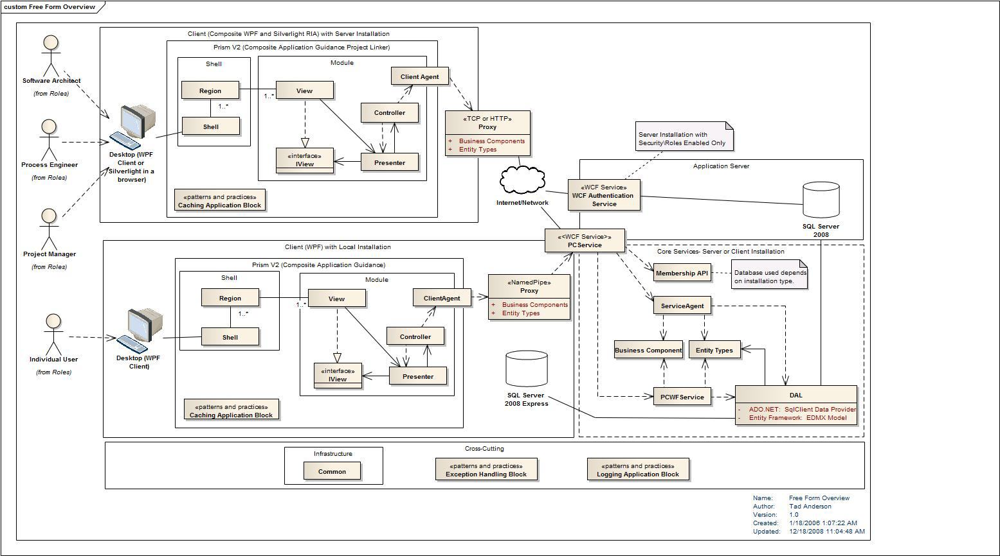
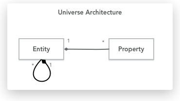
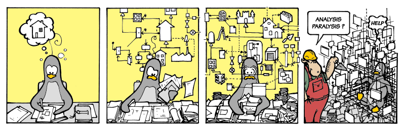
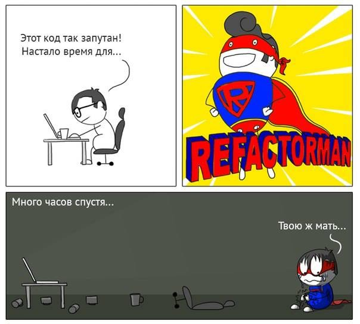

@title[Clean Code]

# Application Architecture

#### Introduction

[Presentation Link](https://github.com/ozelen/presentation-app-architecture)

<br>
<br>
<span class="byline">by Oleksiy Zelenyuk</span>

#VSLIDE

# About Me

#VSLIDE

## Oleksiy Zelenyuk


- ozelen@softserveinc.com
- Skype: oleksa.zelenyuk
- Tel. 1531 (int)
- Github: [ozelen](https://github.com/ozelen/)

#VSLIDE

## In love with JS since 1999



#VSLIDE

## Currently

- COE Solutions                           <!-- .element: class="fragment" -->
- Architect at MK for last 6 months       <!-- .element: class="fragment" -->
- Discover and kickstart new projects     <!-- .element: class="fragment" -->
- Onboarding new comers                   <!-- .element: class="fragment" -->
- Leading Web UI comptence group          <!-- .element: class="fragment" -->

---
## AGENDA

1. What is and isn't Architecture <!-- .element: class="fragment" -->
1. Good and bad Architecture      <!-- .element: class="fragment" -->
1. Methodologies                  <!-- .element: class="fragment" -->
1. Anti-patterns and solutions    <!-- .element: class="fragment" -->

---

#### Chapter 1

# What is and isn't Architecture

---

## What is Architecture



#VSLIDE

## Architecture is

- A structure is a set of elements and the relations among them.                    <!-- .element: class="fragment" -->
- Can be presented by a View                                                        <!-- .element: class="fragment" -->
- A product of a single architect or a small team of architects with a tech leader  <!-- .element: class="fragment" -->
- Delivers the system's important quality attributes.                               <!-- .element: class="fragment" -->

#VSLIDE

## Architecture is not

- Things are easy to change             <!-- .element: class="fragment" -->
- Tools and libraries definition        <!-- .element: class="fragment" -->

#VSLIDE

### Architecture must be driven by requirements, not by tools

#VSLIDE

## Architectural goals

- Define system modules                                         <!-- .element: class="fragment" -->
- Make system more predictable and easier to change             <!-- .element: class="fragment" -->
- Make important decisions early enough                         <!-- .element: class="fragment" -->
- Meet requirements and the budget                              <!-- .element: class="fragment" -->

#VSLIDE
## Architectural goals (MSDN version)

- How will the users be using the application?                                                            <!-- .element: class="fragment" -->
- How will the application be deployed into production and managed?                                       <!-- .element: class="fragment" -->
- What are the quality attribute requirements for the application?                                        <!-- .element: class="fragment" -->
- How can the application be designed to be flexible and maintainable over time?                          <!-- .element: class="fragment" -->
- What are the architectural trends that might impact your application now or after it has been deployed? <!-- .element: class="fragment" -->

#VSLIDE

## Difference from other Architectures

- Code is much easier to change than materials, e.g. walls      <!-- .element: class="fragment" -->
- Requirements for Software are less deterministic              <!-- .element: class="fragment" -->
- Implementation Process is less deterministic as well          <!-- .element: class="fragment" -->
- Very domain specific                                          <!-- .element: class="fragment" -->

#VSLIDE

## Key Architecture Principles

- Build to change instead of building to last.                             <!-- .element: class="fragment" -->
- Model to analyze and reduce risk.                                        <!-- .element: class="fragment" -->
- Use models and visualizations as a communication and collaboration tool. <!-- .element: class="fragment" -->
- Identify key engineering decisions.                                      <!-- .element: class="fragment" -->


#VSLIDE

## Summary

> The software architecture of a system is the set of structures needed to reason
> about the system, which comprise software elements, relations among them, and
> properties of both.

***
*Software Architecture in Practice, Ch. 1 -- What Is Software Architecture?*

---

#### Chapter 2

# Good and bad Architecture

---

## Good Architecture

1. Architecture for change                           <!-- .element: class="fragment" -->
1. Domain Specific                                   <!-- .element: class="fragment" -->
1. Project structure decomposition                   <!-- .element: class="fragment" -->
1. Dependency Management                             <!-- .element: class="fragment" -->
1. Code Standards                                    <!-- .element: class="fragment" -->
1. Pattern-oriented Architecture                     <!-- .element: class="fragment" -->
1. Continuously Maintained                           <!-- .element: class="fragment" -->

#VSLIDE

## Bad Architecture

1. There's no wrong Architecture                        <!-- .element: class="fragment" -->
1. Architecture can be more or less fit for the purpose <!-- .element: class="fragment" -->

#VSLIDE

## Vasa case


#VSLIDE

## Reasons of epic fail

1. No specs.
1. Requirements creep.
1. Architect died meanwhile.
1. No metrics and scientific methods.
1. Tests skipped or ignored.

---

#### Chapter 4

# Methodologies


#VSLIDE

## Attribute Driven Design

#VSLIDE

### Quality attributes

System's non-functional abilities

- Availability.      <!-- .element: class="fragment" -->
- Interoperability.  <!-- .element: class="fragment" -->
- Maintainability.   <!-- .element: class="fragment" -->
- Security.          <!-- .element: class="fragment" -->
- Performance.       <!-- .element: class="fragment" -->
- Reliability.       <!-- .element: class="fragment" -->
- Reusability.       <!-- .element: class="fragment" -->
- etc.               <!-- .element: class="fragment" -->

#VSLIDE

## Domain Driven Design (DDD)

System's domain-specific aspects

- Ubiquitous language               <!-- .element: class="fragment" -->
- Boundary context                  <!-- .element: class="fragment" -->
- Domain-specific module structure  <!-- .element: class="fragment" -->
- Anti-corruption layer             <!-- .element: class="fragment" -->

#VSLIDE

## SOLID

- Provides the basics
- Technology-agnostic
- Simple

---

#### Chapter 3

# Anti-patterns and solutions

---

#### Antipattern

## Dependency hell

#VSLIDE


#### Solution 1

## Reduce Dependencies

- Decouple modules and components                        <!-- .element: class="fragment" -->
- Messaging patterns (Pub/Sub, Message bus, Redux, etx)  <!-- .element: class="fragment" -->
- Manage and reduce external dependencies                <!-- .element: class="fragment" -->
- Inversion of control Principle                         <!-- .element: class="fragment" -->
- Dependency Inversion Principle (SOLID)                 <!-- .element: class="fragment" -->

#VSLIDE

## Tooling-Agnostic architecture

- Design data flows and system elements.                               <!-- .element: class="fragment" -->
- Platforms and libraries you use are important, but could be changed. <!-- .element: class="fragment" -->
- Rather rely on interfaces than on tools and platforms.               <!-- .element: class="fragment" -->


#### Solution 2

## Dependency Inversion

#VSLIDE

#### Example

External library is throughout entire application, replacing it might be hard:

```ts
import axios from 'axios';

const getSomeData = () =>
    axios.get(SOME_API_URL).
        then(actions.updateDataSuccess).
        catch(actions.updateDataFail);
```

#VSLIDE

## Wrap Dependencies

```ts
import http from '../services/http';

const getSomeData = () => http.get(SOME_API_URL).
    then(actions.updateDataSuccess).
    then(actions.updateDataFail);
```

---

## Inversion of control

#VSLIDE

```jsx
// Big config
<AppFrame config={{
    authConfig,
    themeConfig,
    breadCrumbsConfig,
    ...
}} />

// Lego-style IoC
<App theme={theme}>
    <Authorization />
    <AppHeader>
        <BreadCrumbs>
            <Breadcrumb href={'/...'} name={'Home'} />
            <Breadcrumb href={'/...'} name={'Inner Page'} />
            ...
        </BreadCrumbs>
    </AppHeader>
    <Menu elements={[...]} />
</App>
```

@[1-7](Component knows and everything inside)
@[9-20](Component is a wrapper and exposes control to parent)

#VSLIDE

## IoC Examples

- Dependency injection      <!-- .element: class="fragment" -->
- Strategy pattern          <!-- .element: class="fragment" -->
- Decorator pattern         <!-- .element: class="fragment" -->
- Composition               <!-- .element: class="fragment" -->
- Polymorphism              <!-- .element: class="fragment" -->

---

## DI + IoC

are perfectly combined

#VSLIDE

## Invert and segregate

```ts
interface IApi<Model> {
    baseUrl: string;
    getList(): Observable<Model[]>;
    get(id: number): Observable<Model>;
    create(data: Model): Observable<Model|Error>;
    update(data: Model): Observable<Model|Error>;
    destroy(id: number): Observable<Model|Error>;
}

class RestApi<Model> implements IApi {
    readonly baseUrl: string;
    readonly resource: string;

    constructor({baseUrl, resource}) {
        this.baseUrl = baseUrl;
        this.resource = resource;
    }

    getItemList(): Model[] {
        return axios.get(`${this.baseUrl}/${resource}/`);
    }

    getItem(id: number): Model {
        return axios.get(`${this.baseUrl}/${resource}/${id}`);
    }

    ...
}

class FeatureApi extends RestApi<SomeFeatureModel>({
    baseUrl: SOME_API_URL,
    resource: 'some-feature'
});

const api = new RestApi(FeatureApi);
const getDataFromData = () =>
    api.getItems();

export const pollingApi = (action$: ActionsObservable<Action>) =>
  action$.ofType(actions.START_POLLING).
    flatMap(action =>
      Observable.interval(POLLING_INTERVAL).
        takeWhile(someCondition).
        flatMap(getDataFromData).
        map(normalize).
        map(actions.updateFeatureStore));
```

@[1-8](Create an abstract interface)
@[10-28](Implement concrete strategy)
@[30-33](Extend with parameters)
@[35-37](Use in a system component)
@[38-49](Add IoC by Observables and FRP)

---

#### Antipattern

## Tangled relations


#VSLIDE

#### Solution

## Messaging


---
#### Antipattern

## Inventing the wheel

---

#### Solution

## Leverage Standard Interfaces

- Promises              <!-- .element: class="fragment" -->
- Observables           <!-- .element: class="fragment" -->
- Node Streams & Pipes  <!-- .element: class="fragment" -->
- REST                  <!-- .element: class="fragment" -->
- HATEOAS               <!-- .element: class="fragment" -->
- GraphQL               <!-- .element: class="fragment" -->
- OData                 <!-- .element: class="fragment" -->

---

#### Antipattern

## Universe Architecture

Too abstract and soft approach, ends up as too vague and complex in implementation.



---

#### Antipattern

## Groundhog Day


#VSLIDE

Important architectural decisions that were once made get lost, forgotten or are not communicated effectively

#VSLIDE

#### Solution

## Define the solution

1. Make a decision  <!-- .element: class="fragment" -->
1. Document it      <!-- .element: class="fragment" -->
1. Communicate it   <!-- .element: class="fragment" -->

---

#### Antipattern

## Analysis Paralysis



#VSLIDE

It is when you know too much to do anything.


#VSLIDE

#### Solution

## Quick Spikes

1. Make a handdrawn draft            <!-- .element: class="fragment" -->
1. Do prototyping and face problems  <!-- .element: class="fragment" -->
1. Analyse result                    <!-- .element: class="fragment" -->
1. Make a decision out of this       <!-- .element: class="fragment" -->

---

#### Antipattern

## Premature refactoring

Paying too much efforts to decoupling before doing anything

#VSLIDE

#### Solution

## YAGNI

- Don't segregate modules when your scope is vague

---

#### Antipattern

## Big Ball of Mud (BBM)


#VSLIDE

#### Solution #1
# SOLID

- Use them             <!-- .element: class="fragment" -->
- But don't overthink  <!-- .element: class="fragment" -->

#VSLIDE

#### Solution 2

# Continuous Refactoring



---

# Questions


---

# Reference

- [Software Architecture in Practice (3rd Edition) (SEI Series in Software Engineering)](https://www.amazon.com/Software-Architecture-Practice-3rd-Engineering/dp/0321815734)
- [MSDN - Chapter 1: What is Software Architecture?](https://msdn.microsoft.com/en-us/library/ee658098.aspx)
- [MSDN - Chapter 16: Quality Attributes](https://msdn.microsoft.com/en-us/library/ee658094.aspx)
- [Why The Vasa Sank: 10 Lessons Learned](http://faculty.up.edu/lulay/failure/vasacasestudy.pdf)
- [Experiments Boilerplate](https://github.com/ozelen/neo-feed)
